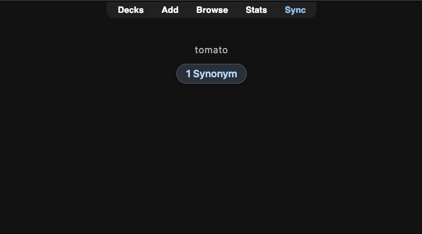
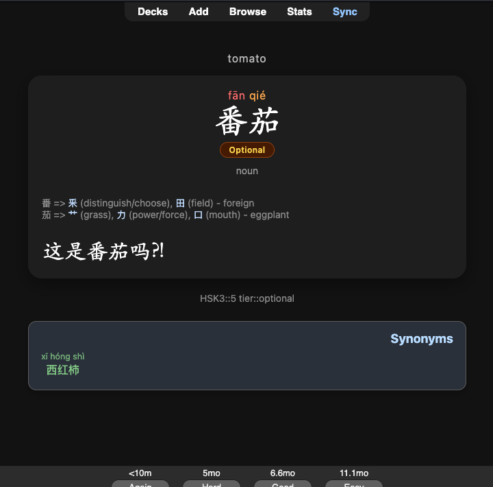

# Chinese Word Synonyms

Anki desktop add-on that shows **synonyms from your own deck** that share the same normalized meaning with the card you’re reviewing.

Example: reviewing **快乐** (happy) → front shows **2 Known Synonyms** / **6 Total Synonyms**; back lists 高兴, 开心, 愉快… when those notes share a meaning sense.

Works offline — your collection only. No external dictionary, AnkiConnect, or CEDICT.

Pairs well with **[Chinese Character Relations](https://github.com/sageozzeus/Chinese-Character-Relations)** (shared characters). Separate menus, indexes, and panels.

## Screenshots

<table>
  <tr>
    <td width="50%" align="center">
      
      <br /><sub>Question — Known / Total</sub>
    </td>
    <td width="50%" align="center">
      
      <br /><sub>Answer — Synonyms panel</sub>
    </td>
  </tr>
</table>

## Requirements

- Anki Desktop **23.10+** (Qt6 preferred)
- macOS, Windows, or Linux
- Notes with a Word/Hanzi field **and** a Meaning/Definition/English field

## Install

### From AnkiWeb (recommended)

1. **Tools → Add-ons → Get Add-ons…**
2. Paste download code: **`1733540881`**
3. Restart Anki when prompted.

Or open the [AnkiWeb listing](https://ankiweb.net/shared/info/1733540881) and click **Download**.

### From GitHub Release

1. Open the latest [Release](https://github.com/sageozzeus/Chinese-Word-Synonyms/releases/latest).
2. Download the **`.ankiaddon`** asset (e.g. `chinese_word_synonyms-0.1.4.ankiaddon`), not Source code.
3. Double-click the file, or open it with Anki / drag it onto the Anki window.
4. Restart Anki when prompted.

### After install

1. Open **Tools → Chinese Word Synonyms…**
2. **General**: set Word / Hanzi + Meaning fields, check **Meaning delimiters**, then **Rebuild Index**.

### Manual (developers)

```bash
./scripts/link-anki-addon.sh
```

Or copy the `chinese_word_synonyms` folder into your Anki add-ons folder, then restart Anki (**Cmd+Q**, reopen):

- **macOS:** `~/Library/Application Support/Anki2/addons21/`
- **Windows:** `%APPDATA%\Anki2\addons21\`
- **Linux:** `~/.local/share/Anki2/addons21/`

## Settings

**Tools → Chinese Word Synonyms…** (or **Tools → Add-ons → Config**):

| Tab | What it’s for |
| --- | --- |
| **General** | Decks, fields, **meaning delimiters**, display limits, **Rebuild Index** |
| **Appearance** | Panel width, type sizes, colors, custom CSS |
| **About** | Version, changelog, [AnkiWeb](https://ankiweb.net/shared/info/1733540881) / Rate links |

**Front card (default):** With **Show only on back** + **Show synonym counts**, the question shows `N Known Synonyms` / `N Total Synonyms` (Known = unsuspended). Full list on the answer.

Rebuild after changing decks, fields, or delimiters. Appearance updates on the next flip.

## How matching works

1. Read the Meaning field; strip HTML; lowercase; drop POS prefixes (`adj.`, `v.`, …).
2. **Split** into senses on your chosen delimiters (default: `;` `,` `|` `/` `；` `、`).
3. Index each note under every sense key.
4. At review, show other notes that share at least one key (same headword excluded).

`happy, glad` → keys `happy` and `glad`. A note with only `happy` matches. Without comma as a delimiter, the whole string stays one key and rarely matches.

Configure delimiters under **General → Meaning delimiters** (checkboxes + optional Extra). Empty meaning → no panel.

## Tips

- Click a synonym → opens that note in the Browser.
- Nothing showing? Check Word + Meaning fields, delimiters, then rebuild.
- Unique meanings correctly show no panel.
- Safe with Character Relations — both panels can appear under the answer.

## Support

- **AnkiWeb:** [listing](https://ankiweb.net/shared/info/1733540881) · code `1733540881`
- **Bugs:** [GitHub Issues](https://github.com/sageozzeus/Chinese-Word-Synonyms/issues)
- **Updates / short questions:** [X @sageozzeus](https://x.com/sageozzeus)
- **Source:** [github.com/sageozzeus/Chinese-Word-Synonyms](https://github.com/sageozzeus/Chinese-Word-Synonyms)

Maintainer docs: [`docs/MAINTENANCE.md`](docs/MAINTENANCE.md) · QA: [`docs/TESTING.md`](docs/TESTING.md) · Reddit: [`docs/REDDIT_RELEASE.md`](docs/REDDIT_RELEASE.md)

## License

MIT — see [`LICENSE`](LICENSE).
